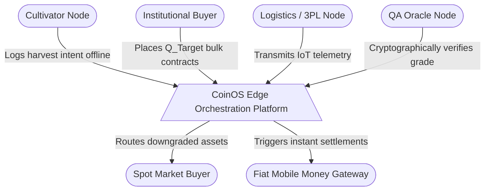
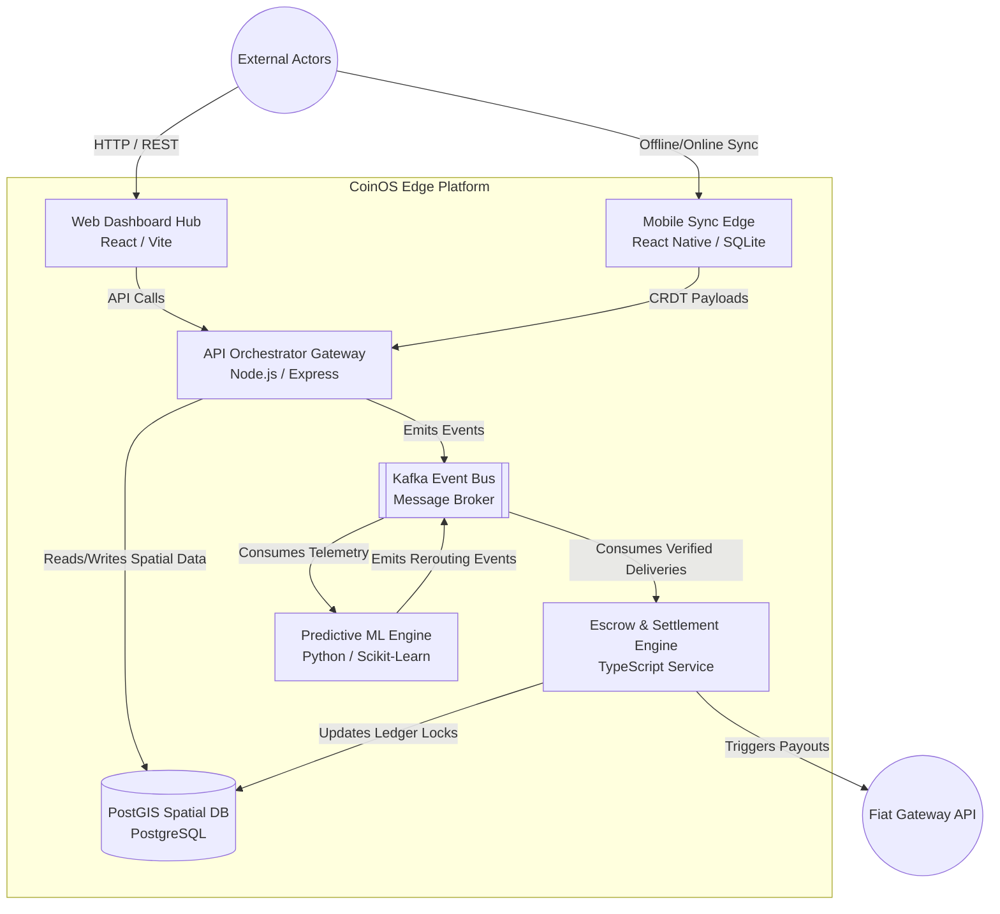
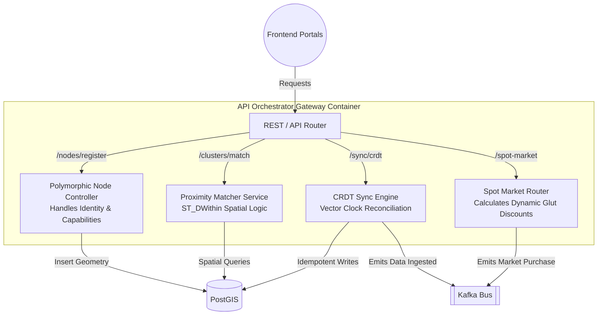
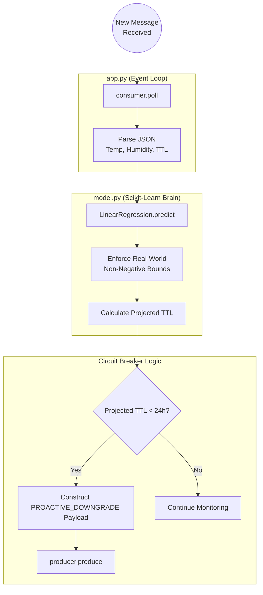

# CoinOS System Structure Charts (C4 Model)

Below is the structural breakdown of the CoinOS architecture, adhering to the C4 model (Context, Container, Component) to decompose the platform from a high-level bird's-eye view down to its primitive processing forms.

---

## 1. Context Diagram (Level 0)
**Scope:** The entire CoinOS Edge Orchestration Platform as a single entity interacting with external actors.

---

## 2. Container Diagram (Level 1)
**Scope:** Zooms inside the CoinOS Platform to show the high-level technical containers (applications, databases, message brokers) and how data flows between them.

---

## 3. Component Diagram (Level 2)
**Scope:** Zooms inside the **API Orchestrator Gateway** container to identify the specific micro-components and logic controllers driving the application.

---

## 4. Primitive Structure Chart (Level 3 Code Breakdown)
**Scope:** Zooms into the exact internal execution logic of a specific component. Here, we break down the **Predictive ML Engine** into its most primitive structural flow.

